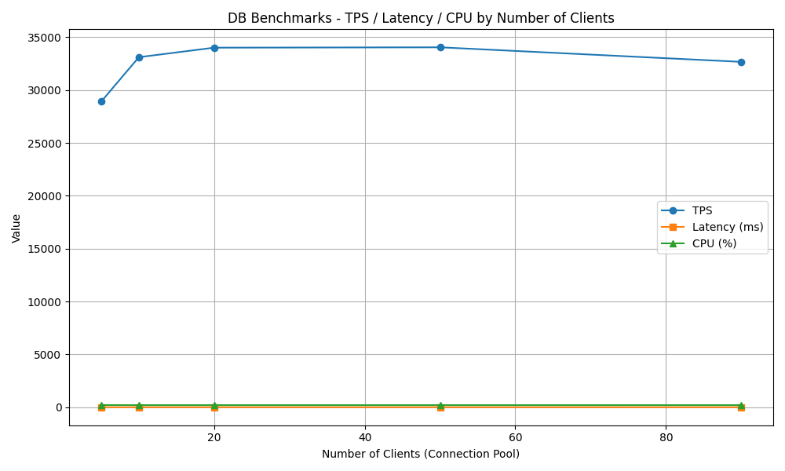
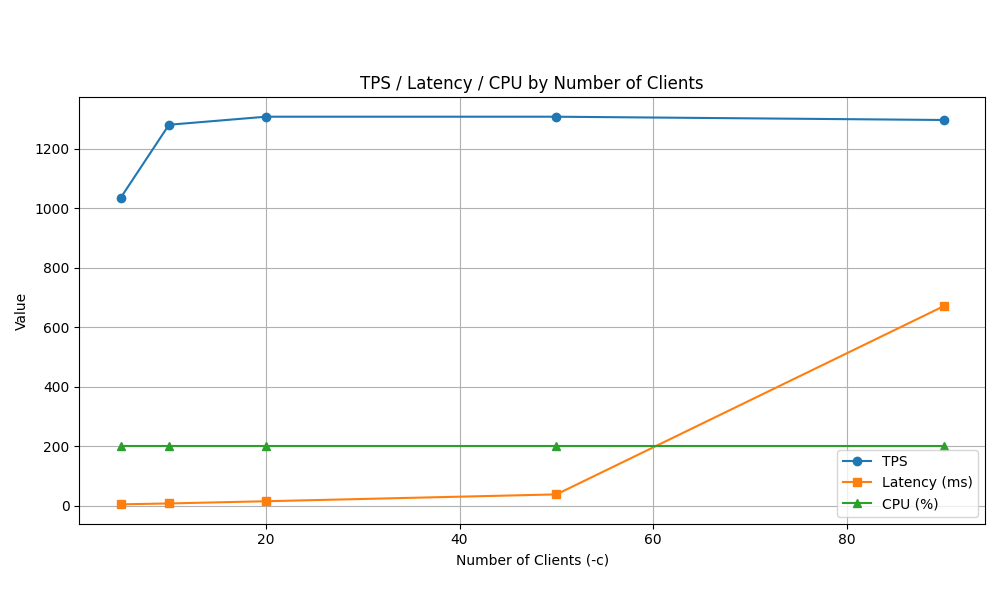
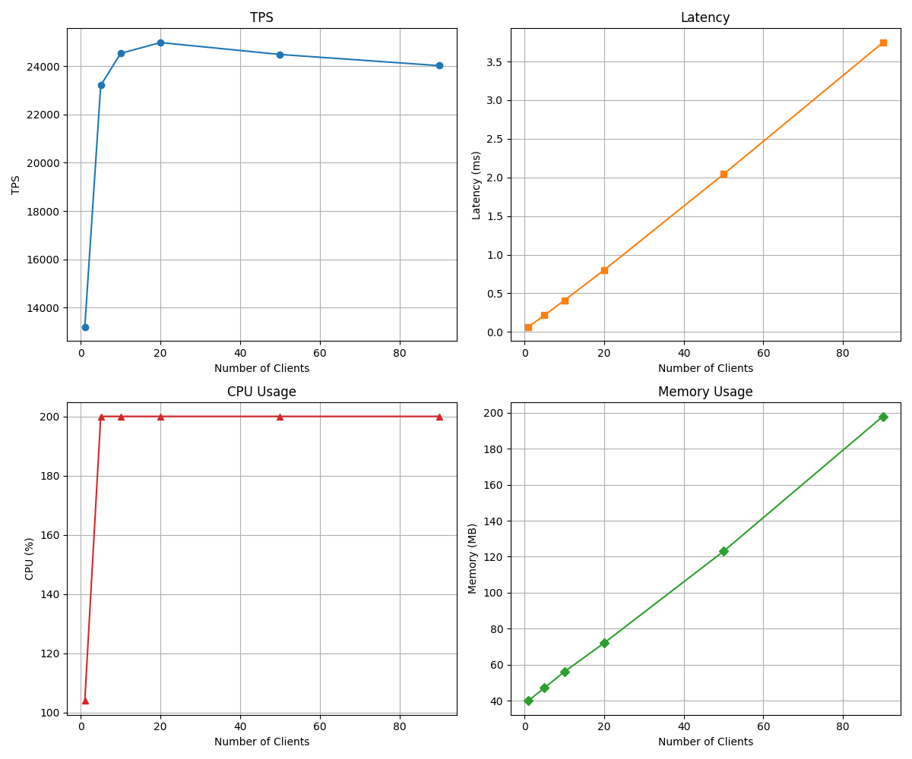
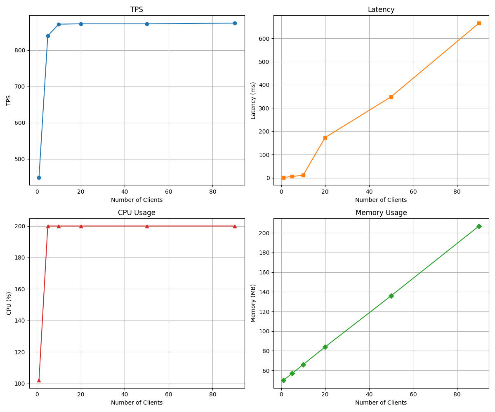

# Load Test

This repository contains scripts and configurations for benchmarking a PostgreSQL database using `pgbench`. The focus is on testing various SQL queries to evaluate performance under different loads.

## Command

### Restore Database

```bash
pg_restore -U postgres -d dvdrental /data/dvdrental.tar
```

### Send SQL

```bash
pgbench -h postgres-test -p 5432 -U postgres -d dvdrental -c 60 -T 10 -f test/02_simple_select.sql --no-vacuum
```

## Threshold

### 01. Simple Select (PK Access)

#### Query

```
\set random_id random(1, 599)
SELECT * FROM customer WHERE customer_id = :random_id;
```

#### Result



- Based on CPU utilization, the optimal connection pool size is 2.
- Based on TPS performance, the optimal connection pool size is 20.
- Latency begins to increase noticeably beyond 20 clients, but memory usage increases linearly and does not become a bottleneck in this test.

### 02. Search by Title (ILIKE)

#### Query

```
\set alpha_id random(65, 90)
SELECT * FROM film WHERE title ILIKE '%' || chr(:alpha_id) || '%';
```

#### Result



- LIKE 연산은 Full Scan이거나, 인덱스를 타도 부분적으로만 빠릅니다.
- 보통 PK 조회 대비 TPS는 확 떨어지고, Latency는 확 늘어납니다.
- 동시 요청 수가 많아지면, 비효율 쿼리가 누적되어, TPS는 거의 변하지 않거나 오히려 줄고, Latency가 기하급수적으로 증가합니다.

### 03. Customer Last Rental (Order By)

#### Query

```
\set random_id random(1, 599)
SELECT * FROM rental WHERE customer_id = :random_id ORDER BY rental_date DESC LIMIT 1;
```
### Result



- Based on CPU utilization, the optimal connection pool size is 2.
- Based on memory usage, there is no significant increase.
- Based on TPS performance, the optimal connection pool size is 20.
- Based on latency, there is no significant increase.
- Indexing the `rental_date` column significantly improves performance.

### 04. Count Rental per Customer (Group By)

#### Query

```sql
SELECT customer_id, COUNT(*) AS rental_count FROM rental GROUP BY customer_id;
```

#### Result



- CPU utilization reaches its maximum with just 2 connections.
- Memory usage increases gradually but does not show abrupt spikes.
- TPS performance plateaus around 10 connections, with a maximum TPS of ~875, which is significantly lower than simple queries.
- Latency increases sharply beyond 10 connections.
- **Group By queries are highly resource-intensive**: TPS drops by 10-20x compared to primary key lookups, making them less suitable for high-concurrency environments.

### 05. Film Rental History (Join)

### 06. Top 10 Film (Join + Group By)

### 07.Top 5 Customer Month (Join + Group By)

### 08. Update Customer (Update)

### 09. Insert Customer (Insert)

### 10. Update Return (Update)

### 11. New Rental Transaction (Insert)
