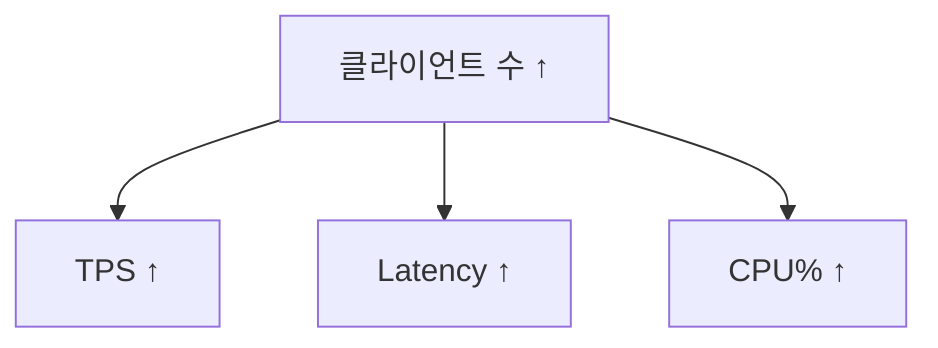

# Lock Test

## Overview

- **Lock**: A mechanism that prevents multiple transactions from accessing the same resource concurrently in a conflicting way.
- **Deadlock**: A situation where two or more transactions are waiting indefinitely for each other to release locks, causing a standstill.
- **Table Lock**: A lock that applies to the entire table, blocking certain operations (read or write) from other transactions until the lock is released.
- **Shared Lock**: A lock that allows multiple transactions to read a resource concurrently, but not modify it.
- **Exclusive Lock**: A lock that allows only one transaction to read or write a resource, blocking all other access.
- **Transaction Timeout**: A situation where a transaction is automatically aborted because it exceeded a predefined time limit.
- **Long Transaction Monitoring**: The process of tracking transactions that are running for an unusually long time, as they can cause resource contention or lock issues.

## System Table

### 1. System Catalog Tables
*(Database structure, schema, and object information)*

- **pg_class**: Information about database objects including tables, indexes, sequences, and views.
- **pg_tables**: Complete list of all tables created in the current database.
- **pg_indexes**: Index list and detailed index information.
- **pg_attribute**: Column (field) information for tables and views.
- **pg_constraint**: Constraint definitions including Primary Key, Foreign Key, Unique, and Check constraints.
- **pg_namespace**: Schema (namespace) information and organization.
- **pg_type**: Data type definitions and custom type information.

### 2. Statistics Views
*(Monitoring database operations, sessions, queries, locks, transactions, and performance)*

- **pg_stat_activity**: Current active sessions, running queries, and connection states.
- **pg_locks**: Current lock status and lock relationships between transactions.
- **pg_stat_user_tables**: Per-table statistics for insert, update, delete, vacuum operations.
- **pg_stat_database**: Database-wide statistics including transactions, commits, rollbacks, and query counts.
- **pg_stat_bgwriter**: Background writer statistics for checkpoints and buffer flushing.
- **pg_stat_replication**: Replication status, WAL transmission, and standby server lag information.
- **pg_stat_all_tables/pg_stat_sys_tables**: Statistics for all tables or system tables specifically.
- **pg_stat_user_indexes**: Index usage statistics and performance metrics.
- **pg_statio_user_tables**: I/O statistics for disk reads and writes per table.
- **pg_stat_ssl**: SSL connection statistics and encryption status.
- **pg_statio_all_tables/pg_statio_user_indexes**: I/O statistics for tables and indexes.

### 3. Configuration and System Information Views
- **pg_settings**: Configuration parameters and values from postgresql.conf.
- **pg_roles**: Role (user and permission) information and privileges.
- **pg_tablespace**: Tablespace (disk group) information and storage locations.

## Command

### Restore Database

```bash
pg_restore -U postgres -d dvdrental /data/dvdrental.tar
```

### Send SQL

```bash
pgbench -h postgres-test -p 5432 -U postgres -d dvdrental -c 60 -T 10 -f test/02_simple_select.sql --no-vacuum
```

## Threshold

### 01. Simple Select



### 02. Search by Title

### 03. Customer Last Rental

### 04. Count Rental per Customer


