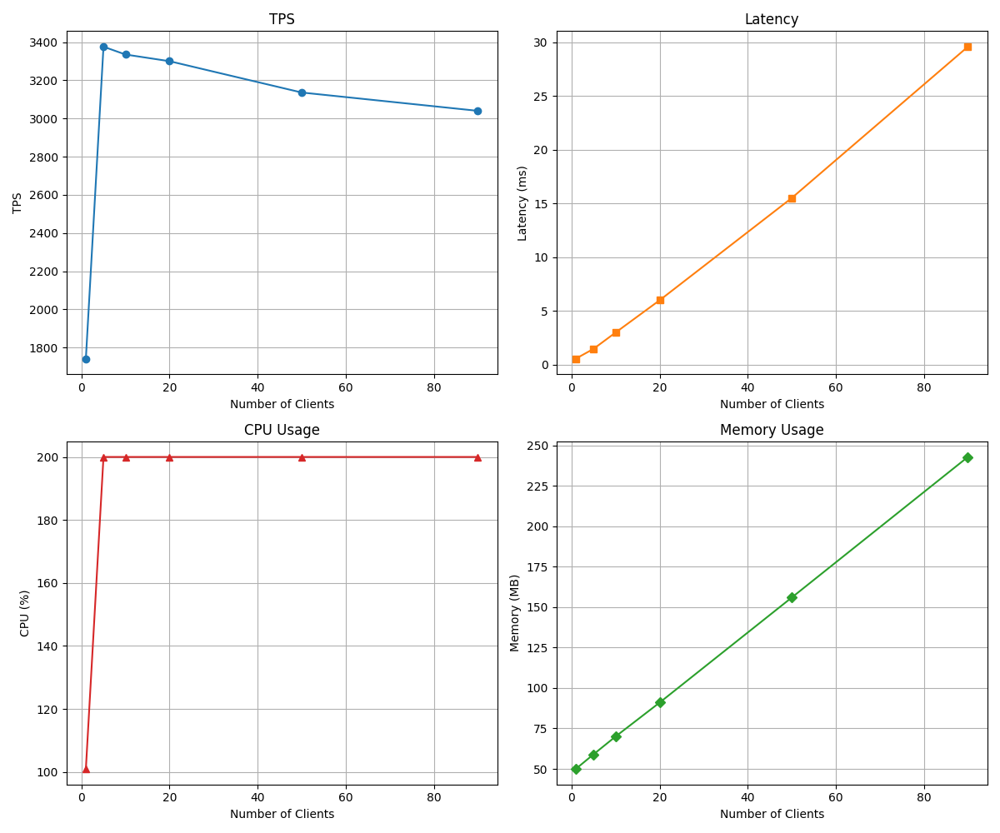

# Load Test

This repository contains scripts and configurations for benchmarking a PostgreSQL database using `pgbench`. The focus is on testing various SQL queries to evaluate performance under different loads.

## Command

### Restore Database

```bash
pg_restore -U postgres -d dvdrental /data/dvdrental.tar
```

### Send SQL

```bash
pgbench -h postgres-test -p 5432 -U postgres -d dvdrental -c 60 -T 10 -f test/02_simple_select.sql --no-vacuum
```

## Threshold

### 01. Simple Select (PK Access)

#### Query

```
\set random_id random(1, 599)
SELECT * FROM customer WHERE customer_id = :random_id;
```

#### Result


- Based on CPU utilization, the optimal connection pool size is 2.
- Based on TPS performance, the optimal connection pool size is 20.
- Latency begins to increase noticeably beyond 20 clients, but memory usage increases linearly and does not become a bottleneck in this test.


### 02. Search by Title (ILIKE)

#### Query

```
\set alpha_id random(65, 90)
SELECT * FROM film WHERE title ILIKE '%' || chr(:alpha_id) || '%';
```

#### Result


- LIKE 연산은 Full Scan이거나, 인덱스를 타도 부분적으로만 빠릅니다.
- 보통 PK 조회 대비 TPS는 확 떨어지고, Latency는 확 늘어납니다.
- 동시 요청 수가 많아지면, 비효율 쿼리가 누적되어, TPS는 거의 변하지 않거나 오히려 줄고, Latency가 기하급수적으로 증가합니다.


### 03. Customer Last Rental (Order By)

#### Query

```
\set random_id random(1, 599)
SELECT * FROM rental WHERE customer_id = :random_id ORDER BY rental_date DESC LIMIT 1;
```
### Result


- Based on CPU utilization, the optimal connection pool size is 2.
- Based on memory usage, there is no significant increase.
- Based on TPS performance, the optimal connection pool size is 20.
- Based on latency, there is no significant increase.
- Indexing the `rental_date` column significantly improves performance.


### 04. Count Rental per Customer (Group By)

#### Query

```sql
SELECT customer_id, COUNT(*) AS rental_count FROM rental GROUP BY customer_id;
```

#### Result


- CPU utilization reaches its maximum with just 2 connections.
- Memory usage increases gradually but does not show abrupt spikes.
- TPS performance plateaus around 10 connections, with a maximum TPS of ~875, which is significantly lower than simple queries.
- Latency increases sharply beyond 10 connections.
- **Group By queries are highly resource-intensive**: TPS drops by 10-20x compared to primary key lookups, making them less suitable for high-concurrency environments.


### 05. Film Rental History (Join)

#### Query

```sql
\set random_film_id random(1, 1000)
SELECT f.title, r.rental_date, c.first_name, c.last_name
FROM rental r
JOIN inventory i ON r.inventory_id = i.inventory_id
JOIN film f ON i.film_id = f.film_id
JOIN customer c ON r.customer_id = c.customer_id
WHERE f.film_id = :random_film_id
ORDER BY r.rental_date DESC
LIMIT 10;
```

#### Result



- CPU utilization reaches its maximum (200%) with just 2 concurrent connections, indicating full resource saturation.
- Memory usage increases steadily as the number of clients grows, but there are no abrupt spikes or out-of-memory risks in this test.
- TPS (transactions per second) peaks at around 3,400 with 5~10 connections, then slightly decreases as concurrency increases further.
- Latency remains low at low concurrency, but increases sharply beyond 10 connections, reaching nearly 30ms at 90 clients.
- Proper indexing dramatically improves join query performance: Efficient use of indexes keeps latency low and TPS high compared to group-by queries, even under higher load.


### 06. Top 10 Film (Join + Group By)

#### Query

```sql
SELECT f.film_id, f.title, COUNT(*) AS rental_count
FROM rental r
JOIN inventory i ON r.inventory_id = i.inventory_id
JOIN film f ON i.film_id = f.film_id
GROUP BY f.film_id, f.title
ORDER BY rental_count DESC
LIMIT 10;
```

#### Result

- [06_top10_film.png](results/06_top10_film.png)

- CPU utilization quickly reaches its maximum (200%) with just 2 concurrent connections, indicating immediate resource saturation for this workload.
- Memory usage increases steadily as client concurrency grows, but there are no abrupt spikes or out-of-memory issues observed within this test window.
- TPS (transactions per second) peaks at approximately 300 with 5 concurrent connections, then gradually declines as concurrency increases, reflecting the heavy computational load of the group-by aggregation.
- Latency rises sharply with increasing concurrency: it remains moderate up to 10 clients (~34ms), but escalates to over 330ms at 90 clients, illustrating significant response time degradation under heavy load.
- Compared to indexed join queries, this complex group-by query results in much lower TPS and higher latency, highlighting that group-by and aggregation operations are major performance bottlenecks in high-concurrency environments.


### 07. Update Customer (Update)

#### Query

```sql
```

#### Result


### 08. Insert Customer (Insert)

#### Query

```sql
```


#### Result

### 09. Update Return (Update)

#### Query

```sql
```


#### Result

### 10. New Rental Transaction (Insert)

#### Query

```sql
```

#### Result
